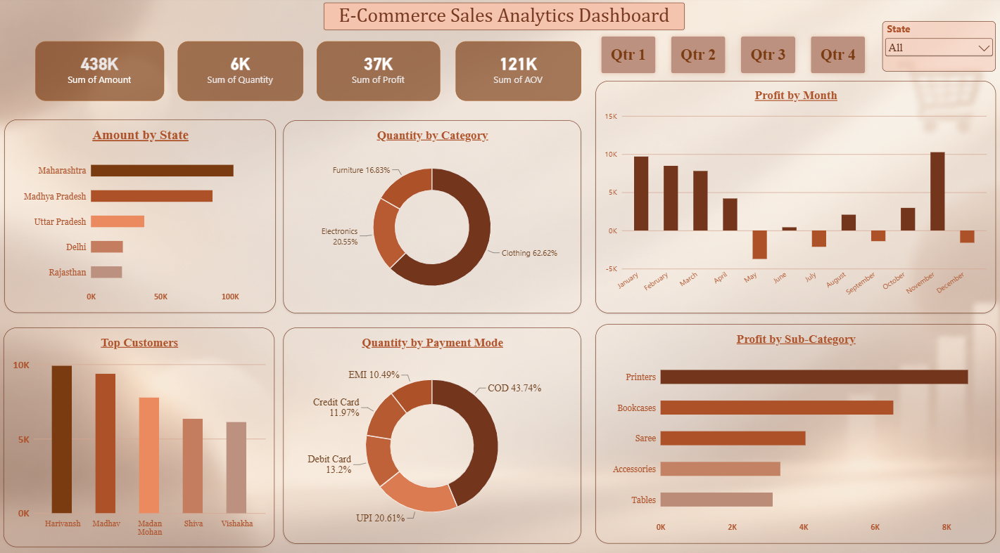

# E-Commerce Sales Analytics Dashboard

## Overview

An interactive Power BI dashboard built to analyze e-commerce sales performance, profitability, customer behavior, product categories, payment methods, and regional sales.

## Tools Used

- Microsoft Power BI
- Data Visualization
- Interactive Filters
- KPI Analysis
- Business Analytics

## Dashboard Metrics

| Metric | Value |
|---|---:|
| Total Amount | 438K |
| Total Quantity | 6K |
| Total Profit | 37K |
| AOV | 121K |

## Analysis Performed

The dashboard provides insights into:

- Sales performance by state
- Product category contribution
- Monthly profit trends
- Top customers by sales
- Payment mode distribution
- Profit by sub-category

## Key Insights

- Maharashtra recorded the highest sales amount among the states shown.
- Clothing contributed the largest share of quantity at 62.62%.
- COD accounted for the largest share of payment modes at 43.74%.
- Printers generated the highest profit among the sub-categories shown.
- Monthly profit varied significantly across the year, with November showing the highest profit in the dashboard.

## Dashboard Preview

## Project File

[View Power BI Dashboard File](E-Commerce%20Sales%20Analytics%20Dashboard.pbix)
